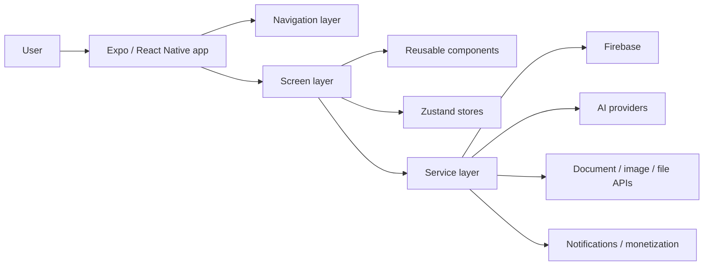
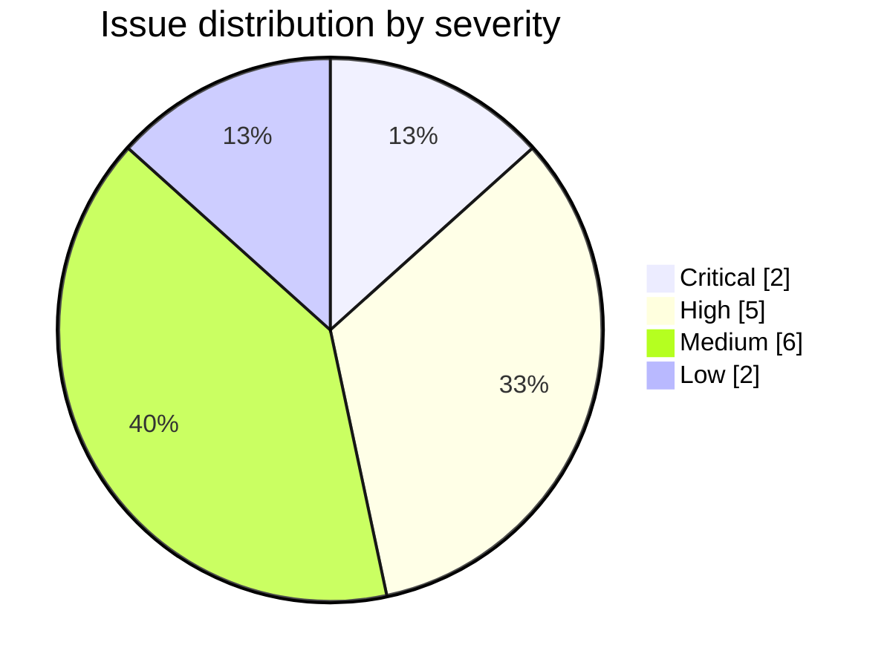

# Prep-AI Repository Review Report

> **Status note:** This is a historical review snapshot from an earlier prototype stage. Since this report was written, the repo has added a `/server` backend, Firebase auth verification, backend-only Groq calls, usage limits, CI, linting, security docs, and release checklists. Treat specific findings about "no backend", "no README", "no CI", or direct client-side AI-provider usage as superseded unless re-confirmed against the current code.

## Executive Summary

This repository is a client-side mobile app built with an entity["software","React Native","mobile app framework"] + Expo-style structure. The root contains only app-side files (`App.js`, `index.js`, `app.config.js`, `app.json`, `eas.json`, `metro.config.js`, `package.json`, `.env.example`) plus `src/` and `assets/`; within `src/`, the code is organized into `components`, `navigation`, `screens`, `services`, `store`, and `utils`. The app surface suggests authentication, resume upload/parsing, interview practice, notifications, progress tracking, and monetization flows. The manifest also shows direct dependencies on `firebase`, `openai`, `groq-sdk`, `expo-notifications`, document/image/file APIs, charting, and Zustand. citeturn36view3turn8view0turn9view0turn9view1turn9view2turn10view0turn11view0turn3view0

The highest-confidence conclusion is that the project is still in prototype stage and is not yet review-ready for production: there is no visible README, no visible project license, no visible `.github` automation, no visible Dockerfile or IaC, only one commit, and no published releases. The `package.json` exposes only `start`, `android`, `ios`, and `web` scripts, with no lint, typecheck, test, audit, or build validation scripts. citeturn41view0turn41view2turn41view3turn59view0turn59view1turn59view2turn36view3turn59view4turn3view0

The most important engineering risk is architectural, not stylistic: the repository appears to place sensitive AI, auth-adjacent, file, and monetization concerns inside a client app without any corresponding backend/BFF/service-gateway code visible in the repo. That is especially problematic because official urlOpenAI API authentication docsturn46search4 state API keys are secrets and must not be exposed in client-side code, and the official JavaScript library docs scope usage to server-side JavaScript; the package page also notes that React Native is not supported. The official urlGroq TypeScript library docsturn45search0 likewise describe the SDK as a server-side Node library and warn that browser support is disabled by default to avoid exposing secret credentials, with React Native explicitly not supported. Expo’s own docs also say `EXPO_PUBLIC_` variables are inlined into the client bundle and should never contain secrets. citeturn3view0turn9view2turn45search2turn51search1turn46search0turn46search1turn46search4turn45search0

My recommendation is to treat this codebase as a promising prototype that should be stabilized in three phases: first, move all AI/provider calls and any privileged business logic behind a server-side trust boundary; second, add CI, tests, typed validation, and structured observability; third, refactor the current screen/service/store layout into feature-owned modules so the codebase can scale without duplication and hidden coupling. citeturn48search10turn56search0turn56search2turn56search4turn55search1turn54search9

## Repository Snapshot

The current code layout is coherent for a prototype. `src/components` contains reusable UI pieces such as `CategoryPicker.js`, `FeedbackCard.js`, `QuestionCard.js`, `ScoreGraph.js`, and `StreakCounter.js`. `src/navigation` contains `AppNavigator.js` and `TabNavigator.js`. `src/screens` contains the product flows: login, signup, onboarding, profile setup, resume, mock interview, practice, daily questions, paywall, progress, and profile. `src/services` contains `authService.js`, `firebaseConfig.js`, `notificationService.js`, `openaiService.js`, `resumeService.js`, `revenueService.js`, and `sessionService.js`. State appears to be limited to `progressStore.js` and `userStore.js`, with constants/prompts under `src/utils`. This is a sensible decomposition for a small app, but it is already broad enough that “service bucket” sprawl is likely. citeturn8view0turn9view0turn9view1turn9view2turn10view0turn11view0

The `package.json` indicates an Expo SDK 54 app running on React Native 0.81 / React 19.1 territory, which is a current platform pairing according to Expo’s SDK 54 reference. Expo’s docs say SDK 54 targets React Native 0.81 / React 19.1 and requires a minimum Node.js version of 20.19.x, but this repository does not visibly pin Node via `engines`, `.nvmrc`, Volta, or CI. That gap will create avoidable onboarding failures and “works on my machine” build drift. citeturn3view0turn58search0turn58search2

From a build/release perspective, the repo looks under-documented. `eas.json` is present, so EAS builds are intended, but there is no visible README explaining environment setup, build profiles, credentials, or local-vs-cloud workflow. Expo’s EAS docs recommend explicitly setting environments and warn that anything embedded in client code is public; they also document local build limitations and environment handling. None of that operational guidance is surfaced in the repo. citeturn36view3turn51search1turn51search4turn51search7turn51search8

The inferred current architecture is below.



This diagram is inferred from the repository tree and dependency manifest, not from full source-blob inspection. citeturn36view3turn8view0turn9view0turn9view1turn9view2turn10view0turn11view0turn3view0

## Prioritized Findings

The table below summarizes the highest-confidence issues. It is derived from the visible repo tree, package manifest, and official platform/security guidance. citeturn36view3turn3view0turn45search2turn46search4turn45search0turn58search2turn55search1turn54search9

| Priority | Severity | Area                       | Finding                                                                                                                       | Evidence pointers                                                   | Est. effort |
| -------- | -------- | -------------------------- | ----------------------------------------------------------------------------------------------------------------------------- | ------------------------------------------------------------------- | ----------: |
| P0       | Critical | Security / Architecture    | AI/provider access appears client-side; secrets would be exposed and SDK/runtime support is mismatched                        | `package.json`, `src/services/openaiService.js`, `src/services/*`   |      16–32h |
| P0       | Critical | Backend / Abuse prevention | No visible server-side trust boundary for authz, rate limiting, request validation, file validation, audit trails             | repo root, no server folder / no backend deps                       |      24–48h |
| P1       | High     | Docs / Onboarding          | No visible README/runbook; env, deployment, and build prerequisites are unspecified                                           | repo root, `package.json`, `eas.json`                               |       6–12h |
| P1       | High     | CI/CD / Quality            | No visible `.github` workflows, no lint/test/typecheck scripts, no code scanning                                              | repo root, `package.json`                                           |       8–16h |
| P1       | High     | Licensing                  | No visible `LICENSE` file and no `license` field in `package.json`                                                            | repo root, `package.json`                                           |        1–2h |
| P1       | High     | Build reproducibility      | Expo SDK 54 requires Node 20.19.x, but Node is not pinned                                                                     | `package.json`, Expo SDK docs                                       |        1–2h |
| P1       | High     | Observability              | No visible logging, monitoring, crash reporting, or security-event telemetry setup                                            | repo tree, missing workflow/docs/supporting files                   |       8–16h |
| P2       | Medium   | Maintainability            | Structure is prototype-friendly but likely to sprawl as screens/services grow                                                 | `src/screens`, `src/services`, `src/store`                          |      12–24h |
| P2       | Medium   | Privacy / Storage          | Resume/profile/notification/auth flows imply PII and tokens; storage/retention/deletion controls are unspecified              | `ResumeScreen.js`, `authService.js`, `notificationService.js`, deps |       8–20h |
| P2       | Medium   | File handling              | Document/image upload surface exists with no visible server-side validation or scanning                                       | document/image/file deps + `resumeService.js`                       |       8–16h |
| P2       | Medium   | Frontend accessibility     | Accessibility standards are not visible in repo-level review; likely missing explicit labels/roles/testIDs                    | multiple screens/components                                         |       6–12h |
| P2       | Medium   | Performance / Bundle size  | Heavy client deps include AI SDKs, Firebase, charts, blob/file libraries; server-only SDKs especially should leave the bundle | `package.json`                                                      |       8–20h |
| P3       | Low      | DevEx / Process maturity   | Single commit, no releases, no project description/topics, no visible contributing docs                                       | repo root                                                           |        2–4h |
| P3       | Low      | DevOps / Infra             | No visible Docker/IaC for any future backend or review app environment                                                        | repo root                                                           |       6–12h |



**P0 — Move AI/provider calls off-device.**  
**Severity:** Critical. **Priority:** P0. **Effort:** 16–32h. The manifest includes both `openai` and `groq-sdk`, and the tree includes `src/services/openaiService.js`; there is no visible backend/service layer elsewhere in the repo. Official docs say OpenAI API keys are secrets and must not be exposed in client-side code, and the official JavaScript SDK is intended for server-side JavaScript; the package metadata also notes React Native is not supported. Groq’s official SDK docs similarly position the library as a server-side Node SDK and describe client-side credential exposure as dangerous. Expo also warns that client-side environment variables are embedded into the bundle. **Repro:** run the app in web mode (`expo start --web` from the visible scripts), inspect the bundle/network activity, and verify whether calls go directly to provider endpoints or whether provider keys/config are embedded. **Suggested fix:** replace direct AI-provider SDK usage in the app with a server-side API that accepts validated app requests, verifies user identity, enforces quotas, and reads provider keys only from server-side secrets. citeturn3view0turn9view2turn45search2turn51search1turn46search0turn46search1turn46search4turn45search0

**P0 — Introduce a backend/BFF for privileged flows.**  
**Severity:** Critical. **Priority:** P0. **Effort:** 24–48h. The repo exposes a pure-app topology: screens, services, stores, utils, and Expo app files, but no API server, functions, edge routes, or worker code. That means the repository currently provides no visible place to enforce centralized request validation, authorization on every request, file upload checks, structured security logging, or business-flow rate limiting. Those controls are exactly what OWASP recommends for API security, input validation, authorization, and logging. **Repro:** inspect the root and `src/` tree; note the absence of any server directory or backend runtime/framework. **Suggested fix:** create `server/` or `functions/` and move AI orchestration, resume ingestion/parsing, entitlement checks, and notification-triggering logic into it. Put auth verification, request schemas, rate limiting, and audit logging there. citeturn36view3turn8view0turn9view0turn9view1turn9view2turn10view0turn11view0turn48search10turn56search0turn56search2turn56search4turn56search5

**P1 — Add baseline documentation immediately.**  
**Severity:** High. **Priority:** P1. **Effort:** 6–12h. There is no visible `README.md`, and the root page has no description, website, or topics. Yet the repository clearly requires environment variables, Firebase setup, Expo/EAS credentials, and probably third-party provider setup. **Repro:** clone/open the repo and note the absence of README and release docs. **Suggested fix:** add a README with prerequisites, exact Node version, install steps, env matrix, local development instructions, build profiles, architecture notes, and troubleshooting. Also add a short `docs/operations.md` for EAS and credentials handling. citeturn41view0turn36view3turn59view4turn58search2turn51search1turn51search4

**P1 — Add CI, static analysis, and test automation.**  
**Severity:** High. **Priority:** P1. **Effort:** 8–16h. The root has no visible `.github` directory and `package.json` has no test/lint/typecheck scripts. GitHub’s official Node workflow docs recommend `actions/setup-node`, `npm ci`, and dependency caching; GitHub also provides CodeQL and push protection for code/security scanning. **Repro:** inspect root tree and `package.json`. **Suggested fix:** add a CI workflow that runs install, lint, typecheck, unit tests, Expo doctor, and security scanning. Enable CodeQL and push protection at the repo level. citeturn41view2turn3view0turn47search3turn47search0turn55search0turn55search1turn54search9

**P1 — Fix project licensing.**  
**Severity:** High. **Priority:** P1. **Effort:** 1–2h. The root page shows no `LICENSE`, and the visible `package.json` does not declare a `license` field. npm’s official docs recommend setting a valid SPDX license string and, if needed, including a top-level license file. Without this, external use and contribution are legally ambiguous. **Repro:** inspect the repo root and package manifest. **Suggested fix:** choose a license intentionally, add `LICENSE`, and add `"license": "<SPDX-ID>"` to `package.json`. citeturn41view3turn3view0turn48search0turn48search1

**P1 — Pin the runtime/toolchain.**  
**Severity:** High. **Priority:** P1. **Effort:** 1–2h. Expo SDK 54 expects React Native 0.81 / React 19.1 and a minimum Node.js version of 20.19.x, but the package manifest does not visibly pin Node. **Repro:** switch machines or CI runners between Node 18 / early Node 20 and compare install/build behavior. **Suggested fix:** add `engines`, `.nvmrc`, or Volta; document it in README; enforce it in CI. citeturn3view0turn58search0turn58search2

**P1 — Add observability and crash reporting.**  
**Severity:** High. **Priority:** P1. **Effort:** 8–16h. The codebase exposes auth, notifications, resume workflows, progress tracking, and premium/paywall flows, but there is no visible monitoring or structured logging setup in the repo tree or workflow layer. OWASP’s logging guidance stresses consistent application logging for both security and operations. **Repro:** inspect repo root and service inventory; no visible tracing/logging/reporting integration is apparent. **Suggested fix:** add structured client logging, backend request logs, security-event logs, and crash reporting with release/build metadata. citeturn9view1turn9view2turn56search4turn56search2

**P2 — Refactor toward feature ownership as the app grows.**  
**Severity:** Medium. **Priority:** P2. **Effort:** 12–24h. The current split into screens/services/store/components is readable, but it will become brittle as more interview/resume/payment/profile behavior accumulates. Shared “service” files often become informal god-objects. **Repro:** count cross-cutting flows already present across `screens/`, `services/`, and `store/`. **Suggested fix:** reorganize by feature (`features/auth`, `features/interview`, `features/resume`, `features/payments`, `features/progress`) with colocated UI, hooks, schemas, tests, and service clients. citeturn9view1turn9view2turn10view0

**P2 — Treat privacy and storage as first-class.**  
**Severity:** Medium. **Priority:** P2. **Effort:** 8–20h. Resume upload, authentication, notifications, premium status, and progress tracking strongly imply PII and account-linked records. OWASP’s mobile storage guidance emphasizes protecting locally stored secrets and preventing sensitive-data leakage. Firebase docs also show that auth persistence behavior matters, and the JS SDK exposes React Native persistence APIs explicitly. **Repro:** verify what is stored locally after sign-in, after resume upload, and after logout; check whether sensitive material is in plain app storage, logs, or caches. **Suggested fix:** use secure storage for secrets/tokens, define retention/deletion flows, avoid storing raw provider responses unless necessary, and document privacy/compliance requirements. citeturn9view1turn9view2turn48search9turn54search0turn54search5

**P2 — Validate and sanitize file ingestion server-side.**  
**Severity:** Medium. **Priority:** P2. **Effort:** 8–16h. The manifest includes `expo-document-picker`, `expo-image-picker`, `expo-file-system`, `expo-sharing`, and `react-native-blob-util`, while the tree includes `ResumeScreen.js` and `resumeService.js`. OWASP recommends allowlist validation, size limits, safe filenames, and upload scanning. **Repro:** attempt oversized files, unsupported extensions, malformed PDFs/images, or repeated uploads; verify rejection path and telemetry. **Suggested fix:** restrict mime types, cap sizes, store with server-assigned names, scan uploads, and separate public-serving from raw storage. citeturn3view0turn9view1turn9view2turn56search0

**P2 — Improve frontend accessibility and performance discipline.**  
**Severity:** Medium. **Priority:** P2. **Effort:** 6–12h. The repo clearly has a large screen surface and custom components, but the review surface did not expose component internals. For mobile apps of this shape, you should assume accessibility and list performance need explicit work unless proven otherwise. Official React Native docs call out `accessible`, labels/roles, and list optimizations such as `keyExtractor`, `getItemLayout`, memoized rows, and avoiding anonymous `renderItem` functions. **Repro:** run VoiceOver/TalkBack through Login, Signup, Resume, Practice, and Paywall flows, then profile scrolling on question/progress lists. **Suggested fix:** add accessibility props/testIDs systematically and optimize long lists and charts. citeturn53search4turn53search0turn53search1turn53search6

**P2 — Reduce bundle size by removing server-only SDKs from the client.**  
**Severity:** Medium. **Priority:** P2. **Effort:** 8–20h. The manifest includes Firebase, charting, blob/file APIs, and both OpenAI/Groq SDKs. Even before detailed code inspection, the highest-value bundle win is removing server-only provider SDKs from the app entirely and replacing them with thin HTTPS calls to your own backend. **Repro:** compare bundle and startup cost before/after removing provider SDKs and lazy-loading infrequent features like charts or resume tooling. **Suggested fix:** keep the app bundle UI-focused; move provider SDKs, parsing, and orchestration server-side. citeturn3view0turn46search0turn45search0

## Build, Quality, and Delivery

The current build surface is minimal: `expo start`, `expo start --android`, `expo start --ios`, and `expo start --web`. There is no visible `test`, `lint`, `typecheck`, `format`, or `build:ci` script. For a production-grade codebase, this is the minimum script surface I would add immediately: `lint`, `format`, `typecheck`, `test`, `test:e2e`, `doctor`, and `ci`. GitHub’s official Node workflow guidance recommends `actions/setup-node`, `npm ci`, and dependency caching; the `setup-node` action itself recommends committing lockfiles and explains its cache behavior. This repository already commits `package-lock.json`, which is a good base to standardize on deterministic installs. citeturn3view0turn36view3turn47search3turn47search0turn55search0

For testing, use Expo’s current guidance instead of inventing custom boilerplate. Expo recommends `jest-expo` plus `@testing-library/react-native`, and explicitly notes that `react-test-renderer` is deprecated for React 19+ contexts. For end-to-end coverage, use `entity["software","Detox","end-to-end testing framework"]`; its official docs say it supports modern React Native versions including the 0.77–0.82 range, which covers this Expo 54 / RN 0.81 stack. citeturn51search3turn51search0turn52search0turn52search1

For static quality gates, I recommend using urlESLint flat config docsturn50search17, urlPrettier install docsturn50search5, and urlTypeScript strict mode docsturn50search0. Even if you do not migrate the whole app at once, adding `allowJs` and migrating high-risk files first will pay off quickly: auth, resume ingestion, provider payload schemas, paywall, and store selectors. citeturn50search13turn50search17turn50search5turn50search0turn50search10

I would also enable GitHub-native security gates from day one: urlCodeQL docsturn55search1 for JavaScript/TypeScript scanning and urlpush protection docsturn54search9 for pre-push secret blocking. Those are high-leverage controls for a repo that currently contains `.env.example`, third-party provider dependencies, and monetization/auth flows. citeturn36view3turn55search1turn54search9

## Security, Privacy, and Compliance

The security review is dominated by trust-boundary issues. The app surface implies user auth, resume ingestion, AI prompts/responses, notifications, and entitlements; those are all areas where the client should be treated as untrusted. entity["organization","OWASP","application security nonprofit"]’s API Security material emphasizes that APIs expose both logic and sensitive data, while the Authorization Cheat Sheet recommends validating permissions on every request, denying by default, and logging security-relevant failures. That guidance aligns directly with what is missing from a client-only architecture. citeturn48search10turn56search2turn56search4

For provider integrations, the rule should be simple: the app may hold public configuration, but it must not hold long-lived provider secrets. Expo says client-side environment values are public once embedded in app code. OpenAI says API keys are secrets and must not be exposed in browsers or apps, and its JS SDK documentation scopes usage to server-side JavaScript; the package metadata also calls out React Native as unsupported. Groq’s official TypeScript SDK says the same class of thing from the opposite direction: the SDK is server-side and client-side credential exposure is dangerous. If you truly require client connectivity for a realtime feature, use short-lived server-minted client secrets rather than the main provider key. citeturn45search2turn51search1turn46search4turn46search0turn46search1turn46search8turn45search0

Because the project uses `entity["software","Firebase","backend-as-a-service platform"]`, I also recommend enabling app attestation. Firebase’s official App Check docs say it helps protect Firebase and custom backend resources from unauthorized clients and can protect your own backend endpoints as well. If you keep any Firebase-backed privileged operations, App Check should be part of the baseline, alongside auth and security rules. citeturn49search0

For privacy and compliance, the repository does not visibly include a privacy notice, data flow documentation, retention policy, or deletion workflow. That matters because resumes, interview answers, profile fields, push tokens, and progress history may all be personal data. The repository tree is enough to conclude the data domains exist; the controls around them are presently unspecified. This is a governance gap even if the code is otherwise functional. citeturn9view1turn9view2turn36view3

## Recommended Changes and Roadmap

The highest-value architectural change is to add a small backend-for-frontend and move all privileged operations there. A thin Node 20+ service is enough at first. The client sends authenticated requests; the backend validates payloads, enforces quotas, calls providers, and returns sanitized results.

```ts
// server/src/routes/interview.ts
import { z } from "zod";
import express from "express";

const router = express.Router();

const InterviewRequest = z.object({
  role: z.string().min(2).max(120),
  resumeText: z.string().min(100).max(20000),
  mode: z.enum(["practice", "mock"])
});

router.post("/v1/interview", async (req, res) => {
  const parsed = InterviewRequest.safeParse(req.body);
  if (!parsed.success) {
    return res.status(400).json({
      error: "invalid_request",
      details: parsed.error.flatten()
    });
  }

  // TODO: verify Firebase ID token here
  // TODO: rate-limit by userId + IP here
  // TODO: call OpenAI / Groq with server-side secrets only

  return res.json({
    ok: true,
    questions: []
  });
});

export default router;
```

That design follows the repository’s functional intent while aligning with official provider guidance and OWASP validation/authorization guidance. citeturn46search4turn45search0turn56search0turn56search2

The next change is to formalize code quality. I would adopt `entity["software","TypeScript","typed superset of JavaScript"]` in strict mode, but stage it. Start with `services/`, `store/`, and any request/response schemas. Add ESLint and Prettier immediately.

```js
// eslint.config.mjs
import js from "@eslint/js";
import globals from "globals";

export default [
  js.configs.recommended,
  {
    files: ["**/*.{js,jsx,ts,tsx}"],
    languageOptions: {
      ecmaVersion: "latest",
      sourceType: "module",
      globals: {
        ...globals.browser,
        ...globals.node
      }
    },
    rules: {
      "no-unused-vars": ["error", { argsIgnorePattern: "^_" }],
      "no-console": ["warn", { allow: ["warn", "error"] }],
      eqeqeq: ["error", "always"],
      "no-implicit-coercion": "error"
    }
  }
];
```

```json
// package.json additions
{
  "scripts": {
    "lint": "eslint .",
    "format": "prettier . --write",
    "typecheck": "tsc --noEmit",
    "test": "jest --coverage",
    "doctor": "npx expo-doctor"
  }
}
```

These recommendations are directly aligned with current official docs for ESLint, Prettier, TypeScript strictness, and Expo testing. citeturn50search17turn50search5turn50search0turn51search3

For CI, I would add a single blocking workflow first, then split later if needed.

```yaml
# .github/workflows/ci.yml
name: ci

on:
  pull_request:
  push:
    branches: [main]

jobs:
  validate:
    runs-on: ubuntu-latest
    steps:
      - uses: actions/checkout@v5

      - uses: actions/setup-node@v6
        with:
          node-version: 20.19.0
          cache: npm

      - run: npm ci
      - run: npm run doctor
      - run: npm run lint
      - run: npm run typecheck
      - run: npm run test -- --coverage
```

Then add CodeQL and secret scanning at the repository level, and schedule `Detox` E2E for nightly or release-candidate builds. GitHub and Expo both support this workflow shape well. citeturn47search3turn55search0turn55search1turn54search9turn52search0

The testing roadmap I would implement is:

- unit tests for pure utilities and prompt builders;
- component tests for `QuestionCard`, `FeedbackCard`, `CategoryPicker`, `ScoreGraph`, and paywall/profile states;
- integration tests for login/signup/onboarding/resume upload flows;
- E2E tests for auth, premium gating, daily questions, resume ingestion, and mock interview happy-path/error-path flows. Expo’s official test docs and Detox’s official setup/docs cover the needed stack. citeturn51search3turn51search0turn52search0turn52search8

A practical roadmap is:

**Next week:** move AI calls off-device, pin Node, add README, add CI, add license.  
**This month:** add backend validation/rate limiting/logging, enable CodeQL + push protection, add Jest + RTL, add App Check.  
**Next quarter:** migrate key modules to TypeScript, refactor to feature folders, add Detox E2E, add observability, document data retention/deletion and incident response. citeturn58search2turn47search3turn55search1turn54search9turn49search0

## Open Questions and Limitations

This review is high confidence on repository topology, manifest, platform fit, and architectural/security gaps. It is lower confidence on line-level implementation details inside most source files because the browser interface exposed directory listings and the manifest reliably, but not most source blobs line-by-line. For that reason, file-path pointers are included wherever source-line pointers were not reliably available.

The most important unresolved questions are: which environment variables exist in `.env.example`; whether `openaiService.js` or other services call providers directly from the app; whether `firebaseConfig.js` uses safe auth persistence patterns; what exactly `revenueService.js` integrates with; what data is persisted locally; and how resume files are parsed, stored, and deleted. Those questions do not change the priority order above, but they will affect the final implementation details of the fixes.
